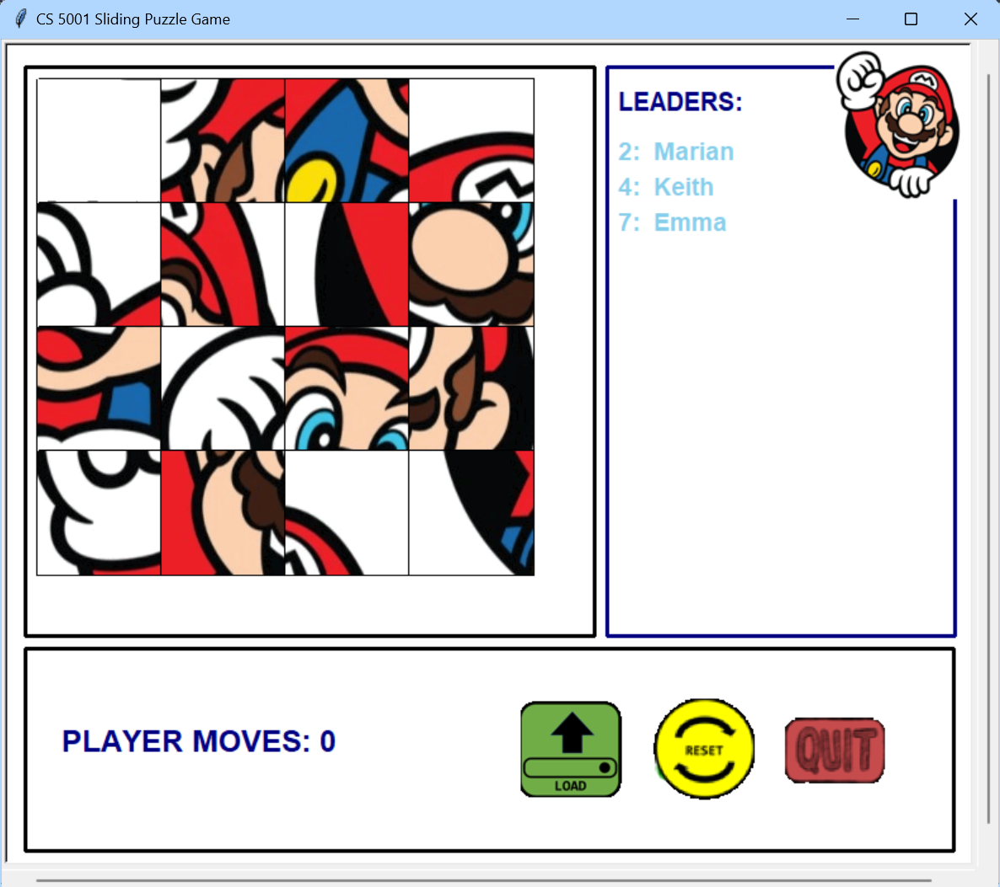

## Sliding Puzzle Game
A Python run combination puzzle where a player must slide pieces vertically or horizontally on a board to establish an end result that matches a solution.
This game was developed as a final project for an intensive foundations of computer science class, and so it follows object-oriented design protocols through the use of classes and objects.

Game play functionality and design were completed following a detailed rubric, and the error handling employed by the program is based on the testing requirements expected from my instructor. A more 
thorough description of the game's design can be found in [design.txt](/src/design.txt).

### Contents
- [Images](Images): Holds individual puzzle images that make up the completed puzzle.
- [Resources](Resources): Contains all images utilized for the UI of the game.
- [src](src): Source folder with Python program files, puzzle files, leaderboard, and error log file.
